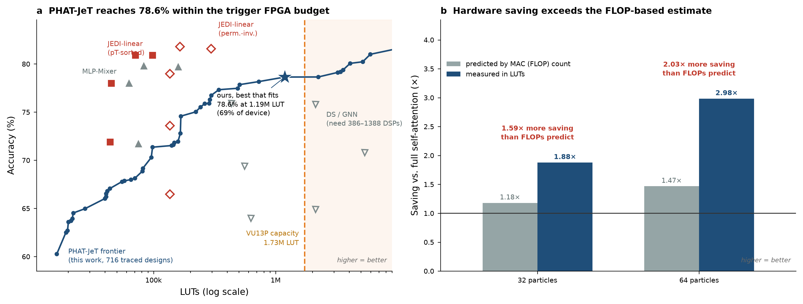
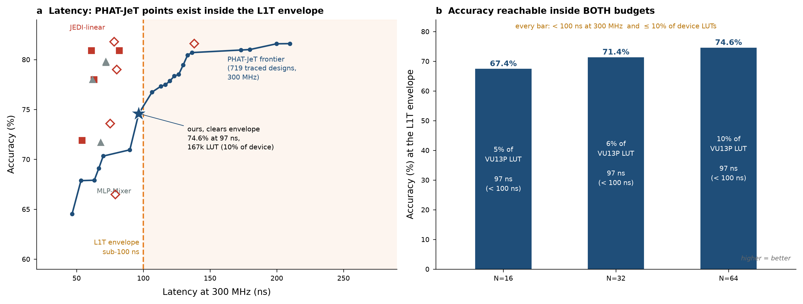

# PHAT-JeT FPGA Hardware Evidence

Hardware implementation flow for **PHAT-JeT** (Patch Hierarchical Attention
Transformer for jet tagging, NeurIPS 2026 submission 28409): HGQ2
quantization-aware training → da4ml distributed-arithmetic conversion →
Verilog for AMD VU13P, producing latency / LUT / FF / DSP / BRAM numbers
comparable to JEDI-Linear ([arXiv:2508.15468](https://arxiv.org/abs/2508.15468)).

Produced for the NeurIPS rebuttal: reviewers asked for FPGA resource evidence
against JEDI-Linear's post-place-and-route results.

## Summary

- **PHAT-JeT can be deployed in the CMS L1 trigger.** At N=64 constituents it
  reaches **74.6%** accuracy at **96.6 ns** latency (300 MHz, II=1). It uses
  **167k LUTs (9.7% of a VU13P)** and no DSPs or BRAM.
- Using more of the device raises accuracy: **78.6% at 902k LUTs (52%)**.
  Latency at that point (236 ns) is above the 100 ns trigger budget.
- **The generated RTL matches Keras bit for bit.** A Verilator check over 2,000
  jets gave a max absolute difference of 0.0 for the 78.64% N=128 design.
- **Patch attention saves more hardware than FLOP counts predict.** Compared
  with the same model using full self-attention, it cuts LUTs **2.98x at N=64**
  (FLOPs predict 1.47x) and **1.88x at N=32** (FLOPs predict 1.18x). The reason
  is that activation-by-activation multiplies fall 7.1x and 3.8x respectively,
  and those need real multipliers.
- **Quantization, not the architecture, limits accuracy.** The float model reaches
  81.6% at N=128 and 81.9% at N=64. Short QAT runs lose 6–8 points; the one long
  run lost 2.95. Bitwidth inspection shows the EBOPs regularizer squeezing the GMP
  block to about 1.3 bits.
- **JEDI-Linear remains smaller at equal accuracy.** For example, it reaches
  80.9% at 98k LUTs (post-route). This study claims feasibility only, not a win
  over JEDI-Linear.

## Results

All PHAT-JeT resource numbers are **da4ml estimates**, not Vivado post-place-and-route
(there was no Vivado run). To calibrate the estimator, JEDI-Linear's own released
N=128 model was traced with the same settings. The estimate was 99,690 LUTs against
their published post-route 97,822 (+1.9%), so these estimates lean slightly
conservative. FF estimates are pessimistic (+41%), so treat them as upper bounds.
Latency = pipeline stages × 3.33 ns (300 MHz, the JEDI-Linear firmware target). Each
design was traced at that clock, not rescaled from another one.

**Trigger budget:** under 100 ns latency, II = 1, under 10% of a VU13P (1.728M LUTs),
since Correlator Layer 2 also runs jet clustering.

| PHAT-JeT design | Acc (%) | LUT | % VU13P | Stages | Latency (ns) | Within budget |
|---|---|---|---|---|---|---|
| N=16 | 67.45 | 87,206 | 5.0 | 29 | 96.6 | yes |
| N=32 | 71.36 | 98,069 | 5.7 | 29 | 96.6 | yes |
| **N=64** | **74.58** | **167,304** | **9.7** | 29 | **96.6** | **yes** |
| N=64, max accuracy | 78.42 | 1,221,621 | 70.7 | 40 | 133.2 | LUTs only |
| N=128, best accuracy per LUT | 78.60 | 902,337 | 52.2 | 71 | 236.4 | LUTs only |
| N=128, bit-exact verified | 78.64 | 1,188,245 | 68.8 | 76 | 253.1 | LUTs only |

All rows: 0 DSP, 0 BRAM, II=1. At N=128 no traced design is under 100 ns: the
serial model needs at least 71 stages. Running the attention branches in parallel
cut latency 1.44x at N=64 (186.5 → 129.9 ns) for 1.6% fewer LUTs. An N=128 parallel
QAT run was started but stopped at epoch 4, before it converged, and was never traced.

Published designs for reference (post-route, from their papers):

| Design | N | Acc (%) | LUT | Latency (ns) | DSP |
|---|---|---|---|---|---|
| JEDI-Linear (pT-sorted) | 32 / 64 / 128 | 78.0 / 80.9 / 80.9 | 45k / 71k / 98k | 63 / 61 / 82 | 0 |
| JEDI-Linear (perm.-inv.) | 64 / 128 | 81.8 / 81.6 | 164k / 296k | 78 / 138 | 0 |
| MLP-Mixer | 64 / 128 | 79.7 / 79.8 | 159k / 83k | 72 / 72 | 0 |
| Deep Sets (MLST'24) | 32 | 75.9 | 434k | 130 | 903 |
| GNN (MLST'24) | 32 | 75.8 | 2.12M | 205 | 1162 |

Full table with every row and stage counts: `docs/comparison_final.md` /
`results/comparison_final.csv`. Per-checkpoint hardware rows: `results/hw_results.json`.




## What it does

1. **Port** PHAT-JeT to a hardware-synthesizable Keras 3 / HGQ2 model (`phat_jet_k3.py`).
2. **Train** it quantization-aware, scanning the accuracy-vs-EBOPs Pareto front (`train_qat.py`).
3. **Trace** each checkpoint with da4ml into a pipelined distributed-arithmetic
   netlist: LUT / FF estimates, pipeline stages, latency at 300 MHz (`extract_hw.py`).
4. **Emit Verilog** for the VU13P and check it bit-exactly against Keras with Verilator.
5. **Benchmark** against JEDI-Linear using its own da4ml settings, and make the
   rebuttal figures and tables.

The aim is to show feasibility: the model fits the CMS L1T envelope (<100 ns, II=1,
~10% of VU13P). It doesn't claim to beat JEDI-Linear. See `TASK_PROMPT.md` /
`docs/HANDOFF.md`.

## How PHAT-JeT was implemented in hardware

The public PHAT-JeT code is TF/Keras 2. It uses dynamic shapes,
`tf.scatter_nd`/`tf.gather_nd`, and a grid that changes per jet. None of that can
go through HGQ2 → da4ml. That flow needs static shapes, only ops in da4ml's trace
registry, and no dynamic indexing. The model was therefore rewritten in
`scripts/phat_jet_k3.py` as a single builder. The same code produces both the float
reference and the quantized (HGQ2) model, so trained float weights load 1:1 into
the quantized model.

### Changes to the architecture

| # | Paper model | Hardware model | Why |
|---|---|---|---|
| 1 | GMP on a per-jet dynamic grid, `scatter_nd` / `gather_nd` | **Fixed grid** within ±0.4 in η/φ. Per-bin one-hot indicator LUTs, an outer product to cells, and einsum scatter-add → depthwise conv → einsum gather-back. Same math. | Dynamic indexing can't be traced. Inputs are jet-relative, and 99.9% of constituents fall within ±0.4. |
| 2 | Uniform δ=0.1 bins | **`core7`**: 7×7 non-uniform bins, 0.08 wide in the core (\|x\|<0.2), wider outside | Fine bins where the jet core sits. In a short QAT comparison it beat the uniform 8×8 grid by **+2.0 points** at lower cost (`docs/grid_study.md`). |
| 3 | 8×8 depthwise kernel on a δ=0.05 grid | 3×3 kernel on the fixed grid | Similar physical receptive field (~0.3 vs ~0.4) |
| 4 | Patch size 10 on 150 particles | Patch size 8 on 128 particles (16 patches, no padding) | Matches JEDI-Linear's 128-particle input. The paper's sweep shows low sensitivity to patch size. |
| 5 | LayerNorm | **Removed** | A runtime divide and square root don't fit a fully unrolled II=1 design. JEDI-Linear has no runtime normalization either. |
| 6 | Attention scaled by 1/√d_head; softmax output | Scale folded into W_q; the model outputs logits | Exact reparameterization; argmax doesn't need softmax on chip |
| 7 | — | Softmax exp-table input capped at 5 integer bits | HGQ sized the exp table from rare outliers (1024 entries). The cap cut lookup logic 4.1x, **−24.6% total LUTs** for +0.05% accuracy. 4 bits loses 3.1%. |
| 8 | — | Optional `parallel_attn`: local and patch attention as parallel branches | Pipeline depth becomes max(local, patch) instead of their sum: **1.44x lower latency** at N=64. This computes a different function, so the model has to be trained this way. |

### Fixes needed to make it trace and train

- **Tracer limits:** `ops.stack` → `Concatenate` + `Reshape`. `ops.mean`/`ops.sum` →
  `hgq.layers.QSum(scale=1/8)`, a power-of-two shift. Einsum indices must be lowercase.
  Custom `Layer` subclasses are invisible to the tracer, so everything is functional
  Keras ops or registered Q-layers.
- **Float donor must match the hardware model.** QAT initialized from a donor trained
  *with* LayerNorm collapsed. `float_pretrain.py` therefore trains the exact LN-free
  `core7` architecture. Each N needs its own donor (`float_n.py`): cutting an N=128
  model down to N=32 drops it from 78.6% to 63.3%.
- **QAT recipe:** quantizers and callbacks are copied from HGQ2's `jsc150` example,
  the flow JEDI-Linear used. It runs 1000 CPU epochs instead of 7000 GPU epochs.
  `FLOOR_BITS` adds a minimum on fractional bits, to stop the EBOPs penalty from
  shrinking the GMP block to about 1 bit.
- **HGQ 0.1.9 bug:** the integer-bit constraint on the softmax exp table is applied to
  the wrong variable during training. The `ClampSoftmaxExpBits` callback in
  `train_qat.py` re-applies the cap after every epoch.
- **Input preprocessing:** robust scaling per feature (median/IQR). The padding mask
  must be computed *before* scaling. Doing it after silently dropped accuracy to
  24.5%, so `load_jets()` now fails loudly if the padding fraction is off.
- **Input port width:** widened from `(1,6,8)` to `(1,7,8)`. Over the full dataset,
  58 constituents exceed ±64 and were wrapping to negative pT. The extra bit costs
  +192 LUTs.
- **Checkpoints:** `.keras` files can't be deserialized because the GMP indicators
  are closures. The extraction scripts rebuild the model in code and call
  `load_weights(skip_mismatch=False)`.
- **macOS Verilator build:** da4ml's emulator makefile is written for Linux.
  `extract_hw.compile_emulator()` patches the linker flags and `nproc`.

## Contents

**Start with the PHAT-JeT pipeline scripts.** These define the model and take it
from data to Verilog. Everything else is an experiment built on top of them.

```
scripts/
  # ── PHAT-JeT architecture + pipeline (start here) ─────────────────────────
  phat_jet_k3.py      THE MODEL: hardware-synthesizable PHAT-JeT
                      (build_phat_jet_k3: float or quantized, same code path)
  preprocess.py       data: load_jets(), robust_scale(), gmp_edges_scaled()
  grid_shootout.py    defines GRIDS (the fixed GMP bin edges, incl. core7)
  float_pretrain.py   step 1: float training at N=128
  float_n.py          step 1b: float donor at another N (16/32/64)
  train_qat.py        step 2: HGQ2 QAT -> Pareto checkpoints (build_qat_model)
  extract_hw.py       step 3: checkpoint -> LUT/FF/latency + Verilog + RTL check
  trace_n.py          step 3 (quick): LUT/FF/latency only, no Verilog
  bitexact.py         step 4: standalone RTL-vs-Keras bit-exactness check

  # ── experiments: training variants ────────────────────────────────────────
  train_hold.py, train_floor.py, train_qat_continue.py  QAT held at a fixed operating point
  recover.py .. recover4.py, lrscan.py, lrscan2.py     fine-tune for accuracy at fixed cost
  init_pretrained.py                                   load the original repo's float weights

  # ── experiments: hardware studies / benchmarks ────────────────────────────
  nsweep.py, watch_trace.py, trace_budget_band.py      trace many checkpoints
  attn_shootout.py, depth_ablate.py, attrib_n.py, sweep_latency.py   where LUTs/stages go
  qdiag.py                                             where quantization loses accuracy
  bench_headtohead.py, run_bench_phat.py               PHAT-JeT on JEDI-Linear's da4ml settings
  build_jedi.py, bench_jedi_family.py, jedi_scaled.py  JEDI-Linear reference points
  dominance.py, make_rebuttal_figs.py                  iso-accuracy comparison, figures
docs/       PROJECT_NOTES.md (decision log), HANDOFF.md (lab notebook), grid study, rebuttal text
results/    hw_results.json, comparison_final.csv, component cost breakdowns
```

Only code, docs and the small result files are tracked. Checkpoints, traces,
Verilog projects and the dataset are local-only (see `.gitignore`).

## Setup

```bash
conda create -n fpga python=3.11 numpy scipy h5py pandas scikit-learn matplotlib
conda activate fpga
pip install "keras>=3.10" jax hgq2 da4ml hls4ml tensorflow
conda install -c conda-forge verilator   # for bit-exact RTL emulation
```

## Data

[hls4ml LHC jet dataset, 150 particles](https://zenodo.org/records/3602260)
(`hls4ml_LHCjet_150p_train.tar.gz` + `_val.tar.gz`). Preprocess to the
JEDI-Linear-matched config — 128 highest-pT constituents × (pT, ηrel, φrel),
zero-padded, 5-class one-hot — with the snippet in `docs/PROJECT_NOTES.md`
(§ Dataset); output is `data/jets_128x3.npz` (620k train / 260k val).

## How to use

Run everything from the repo root in the `fpga` env. Outputs (checkpoints, logs,
Verilog projects) are written to the repo root.

```bash
export KERAS_BACKEND=jax GRID_NAME=core7
```

**1. Train the float model** (the QAT model starts from these weights)

```bash
python scripts/float_pretrain.py 60                    # N=128 -> float_phatjet_core7.keras
N_PARTICLES=64 WARM=128 python scripts/float_n.py 30   # N=64  -> float_phatjet_core7_n64.keras
```

**2. Quantization-aware training.** A single run sweeps the EBOPs penalty upward,
keeping every non-dominated (accuracy, EBOPs) epoch.

```bash
N_PARTICLES=64 RUN_TAG=qat_n64 FLOOR_BITS=2 QAT_EPOCHS=1000 python scripts/train_qat.py
# -> pareto_qat_n64/epoch=..-val_acc=..-ebops=...keras, qat_n64_log.csv
```

| Env var | Default | Meaning |
|---|---|---|
| `N_PARTICLES` / `PATCH_SIZE` | 128 / 8 | constituents per jet / particles per patch |
| `D_MODEL` / `NUM_HEADS` | 16 / 4 | width / attention heads |
| `PARALLEL_ATTN` | 0 | 1 = parallel local/patch attention (lower latency; needs a parallel float donor) |
| `FLOAT_CK` | `float_phatjet_core7[_nN].keras` | float donor to start from |
| `QAT_RESUME` | — | continue from an already-quantized checkpoint |
| `FLOOR_BITS` | 0 | minimum fractional bits per quantizer |
| `QAT_EPOCHS`, `BETA0`, `BETA_MULT` | 1000, 2e-8, 1 | schedule length and EBOPs-penalty ramp |
| `RUN_TAG` | — | **must be unique per run** (CSV logs append) |

**3. Hardware numbers + Verilog.** Always pass the checkpoint explicitly, and
re-evaluate accuracy rather than trusting the filename: several filenames were
more than 1 point optimistic.

```bash
N_PARTICLES=64 python scripts/extract_hw.py pareto_qat_n64/<ckpt>.keras
#   -> Verilog in verilog_<ckpt>/, row in results/hw_results.json
#   N_PARTICLES must match the checkpoint (default 128). SKIP_EMU=1 skips the slow Verilator build.
python scripts/trace_n.py <ckpt>.keras 64    # quick estimate only (args: ckpt N [patch_size])
```

Latency = pipeline stages × 3.33 ns (300 MHz), traced with a latency cutoff of 4.0.
Don't requote a design at another clock; retrace it instead.

**4. Bit-exactness check**

```bash
BE_CKPT=<ckpt>.keras BE_PRJ=bitexact_prj python scripts/bitexact.py
```

**Use the model directly**

```python
import sys; sys.path.insert(0, "scripts")
from preprocess import gmp_edges_scaled
from phat_jet_k3 import build_phat_jet_k3
from train_qat import build_qat_model

edges = gmp_edges_scaled("core7")                  # fixed GMP grid, robust-scaled units
model  = build_phat_jet_k3(num_particles=64, gmp_edges=edges)   # float reference
qmodel = build_qat_model(gmp_edges=edges, num_particles=64)      # HGQ2, same layer names
qmodel.load_weights("pareto_qat_n64/<ckpt>.keras", skip_mismatch=False)
```

Resource numbers are **da4ml estimates** (no Vivado run). JEDI-Linear's numbers
are post-place-and-route; every comparison table labels which is which.

## Repository notes

The code was cleaned up before publishing:

- **Shared data loading.** About 20 scripts each had their own copy of the dataset
  loading and scaling code. They now call `preprocess.load_jets()`. Its output was
  checked to be bit-identical to the old code.
- **Shared GMP bin edges.** Scripts that recomputed the edges by hand now use
  `preprocess.gmp_edges_scaled()`.
- **Bug fix in `bench_headtohead.py`.** With `emulate=True`, the script never built
  its Verilog model. The error was silently caught, so the RTL check never ran there.
- **Removed a hard-coded absolute path** in `init_pretrained.py`.

`docs/HANDOFF.md` is the full lab notebook: pitfalls hit along the way, numbers that
were later superseded, and how to restart the runs that were stopped.
